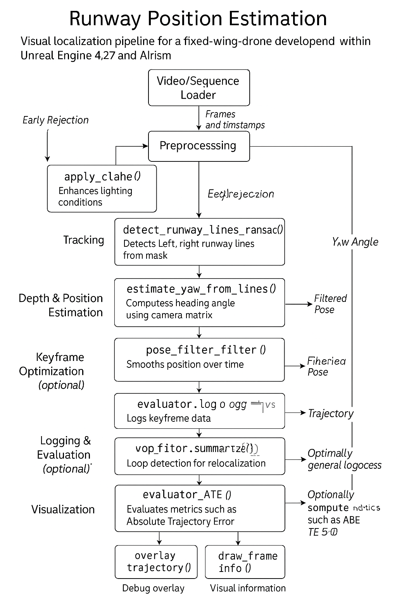

# 🛬 Runway_Position_Estimation

A real-time hybrid visual localization pipeline for runway-relative pose estimation using monocular video.

---

## 📌 Key Features




- **Semantic Runway Detection** — via Segment Anything (SAM) with early rejection.
- **Vanishing Point Estimation** — using RANSAC-based line fitting to estimate heading angle (yaw).
- **Hybrid Tracking** — ORB-SLAM3 fallback with LightGlue + SuperPoint frontend.
- **Depth & Flow Fusion** — fuses M4Depth / MiDaS and RAFT optical flow for 3D position.
- **Temporal Filtering** — smooths estimates with a custom pose filter.
- **Loop Closure** — optional relocalization and pose graph optimization.
- **Supports** image sequences, video files, webcam (real-time), CPU or GPU.
- **Deployment** on Hugging Face Spaces and Google Colab.

---

## 🚀 Quick Start

### 🔧 1. Setup (Local)

```bash
git clone https://github.com/alpermutlu2/Runway_Position_Estimation.git
cd Runway_Position_Estimation
bash setup.sh
```

---

### 🧪 2. Run on a Video

```bash
python main.py \
    --video assets/sample_runway.mp4 \
    --realtime \
    --visualize \
    --save
```

You can also use `--image_dir` for KITTI-style image folders or leave both empty to run on dummy frames.

---

## 🌐 Try Online

- **🤗 Hugging Face Space**: [Runway Estimation App](https://huggingface.co/spaces/your_username/runway-estimation)  
- **🧪 Colab Demo**: [Open Notebook](https://colab.research.google.com/github/alpermutlu2/Runway_Position_Estimation/blob/main/Runway_Position_Estimation_Demo.ipynb)

---

## ⚙️ Arguments

| Flag | Description |
|------|-------------|
| `--video` | Path to input video |
| `--image_dir` | Path to image sequence |
| `--realtime` | Enable real-time visualization |
| `--save` | Save output video |
| `--device` | `cuda` or `cpu` |
| `--visualize` | Draw debug overlays |
| `--gt_path` | KITTI-style GT pose file |
| `--enable_loop_closure` | Enables relocalization and graph optimization |
| `--skip_weight_check` | Skip download check on boot |

---

## 📁 Directory Structure

```
Runway_Position_Estimation/
├── main.py
├── setup.sh
├── requirements.txt
├── Runway_Position_Estimation_Demo.ipynb
├── tracking/
├── depth/
├── inference/
├── evaluation/
├── optimization/
├── utils/
└── scripts/
```

---

## 📊 Evaluation

Supports KITTI-format trajectory logging, ATE computation, and keyframe optimization. Compatible with TUM/KITTI visual SLAM benchmarks.

---

## 🧠 Credits

Developed by [@alpermutlu2](https://github.com/alpermutlu2)  
Includes components inspired by MiDaS, LightGlue, ORB-SLAM3, RAFT, SAM, and more.

---

## 📝 License

MIT License (c) 2024-present. See `LICENSE`.